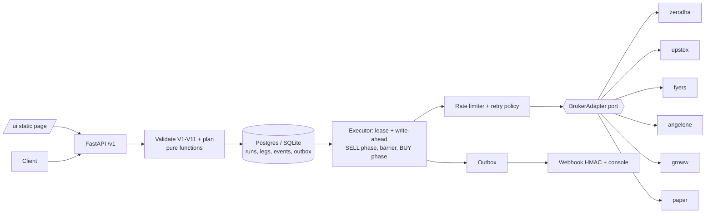

# Kalpi Portfolio Trade Execution Engine

FastAPI service that takes an explicit portfolio instruction set (SELL / BUY / REBALANCE),
connects to the user's broker, executes the orders in one call, and sends a webhook summarising
executed and failed orders. Five broker adapters (Zerodha, Upstox, Fyers, AngelOne, Groww) plus a
Paper broker, all behind one `BrokerAdapter` port.

> **Honest status:** the five real adapters are tested against **mocked HTTP only**. No real broker
> call has been made, so every one ships `experimental=true`, `live_tested=false`. The engine itself
> (ordering, retries, crash recovery, idempotency) is tested end to end on the Paper broker with
> fault injection. See [What is tested vs mocked](#what-is-tested-vs-mocked) and
> [Limitations](#limitations).

## Quick start (Docker)

```bash
cp .env.example .env
# Generate FERNET_KEY (encrypts broker tokens at rest) and paste it into .env as FERNET_KEY=...
python -c "import base64,os; print(base64.urlsafe_b64encode(os.urandom(32)).decode())"
# API_KEYS in .env is "user:key[,user:key]". The default is demo:change-me-demo-key.
# The API key you send in X-API-Key (and type into the UI) is the part after the colon.
docker compose up --build -d      # drop -d to watch the logs
curl localhost:8000/healthz       # {"status":"ok"}
```

Then open <http://localhost:8000/ui> (API key box: `change-me-demo-key`, broker: Paper). To try
the file upload, pick [`docs/samples/rebalance.json`](docs/samples/rebalance.json) or
[`docs/samples/rebalance.csv`](docs/samples/rebalance.csv) with "Load portfolio from a file", then
Preview. JSON is the same payload as the box (`options` + `instructions`, optional `mode`); CSV has
columns `symbol, action, quantity` and optional `side, order_type, limit_price`. A malformed file
shows an error naming the line and leaves the box unchanged.
API docs: <http://localhost:8000/docs>. Without a `.env` the API and UI answer 401/503.
`docker compose down` stops it; `down -v` also deletes the Postgres volume.

Port 8000 busy, or a second copy of the repo on the same machine? Compose names the project after
the directory, so two clones in same-named directories share containers and a volume. Give the
second one its own name and port: `APP_PORT=18000 docker compose -p kalpi-second up --build -d`
(then use `localhost:18000`). Never run `down -v` on a project whose data you want to keep.

### Try it with curl (Paper broker)

```bash
API=localhost:8000
H=(-H "X-API-Key: change-me-demo-key" -H "Content-Type: application/json")
SID=$(curl -s "${H[@]}" -X POST $API/v1/sessions \
  -d '{"broker":"paper","credentials":{"profile":"demo"}}' \
  | python -c "import sys,json; print(json.load(sys.stdin)['session_id'])")
BODY='{"session_id":"'$SID'","mode":"REBALANCE","instructions":[
  {"symbol":"TCS","action":"SELL","quantity":2},
  {"symbol":"INFY","action":"REBALANCE","side":"BUY","quantity":3},
  {"symbol":"HDFCBANK","action":"BUY","quantity":4}]}'
curl -s "${H[@]}" -X POST $API/v1/executions/preview -d "$BODY"          # plan + warnings, no orders
curl -s "${H[@]}" -H "Idempotency-Key: demo-1" -X POST $API/v1/executions -d "$BODY"   # 202 + run_id
curl -s "${H[@]}" $API/v1/executions/<run_id>                            # legs, events, notification
curl -s $API/mock/webhook                                                # webhooks the demo receiver got
```

`bash scripts/demo.sh` runs exactly these commands end to end and exits 0 only if the run reaches
`COMPLETED` and the webhook arrives. `uv run python scripts/ui_smoke.py` does the same through the
UI's own API calls (and saves screenshots to `docs/img/`). Tests without Docker:
`uv sync && make check`.

## How it works



| Module (`src/kalpi_engine/`) | Role |
|---|---|
| `domain/` | pydantic models, enums, error taxonomy. Imports nothing internal, no I/O. |
| `planner/` | Pure functions: validation V1-V11 and payload -> ordered legs. |
| `brokers/` | `base.py` (port + shared httpx client + response classification), one file per broker, auto-discovered by `registry.py`. |
| `execution/` | Executor, run lease, leg state writer, rate limiter and retry, reconciliation, resume, finalise. |
| `notify/` | Transactional outbox, HMAC-SHA256 signing, delivery worker. |
| `storage/` | SQLAlchemy async tables, repo, Fernet token encryption. |
| `api/` | Routers: brokers, sessions (OAuth + credentials), executions, mock webhook, `/ui`. |

### Rebalance logic, with an example

There is no delta computation (D6): the payload says exactly what to do and the engine validates
it against live holdings. Paper's demo account holds RELIANCE 10, TCS 5, INFY 8, ITC 40; send:

```
SELL TCS 2   |   REBALANCE INFY side=BUY qty=3   |   BUY HDFCBANK 4
```

1. **Validate, whole request or nothing** (HTTP 4xx, no run, nothing sent to the broker). Examples:
   SELL beyond the *sellable* quantity (V4, computed conservatively per broker), duplicate symbol,
   unknown symbol, LIMIT without a price, `FIRST_TIME` while holdings exist (409). Warnings, not
   errors: BUY of an already-held symbol, outside market hours, MARKET on a broker whose market-order
   handling is unverified.
2. **Plan**: SELL legs (phase 1) then BUY legs (phase 2); each leg gets a deterministic order tag
   derived from `run_id` + leg index. Legs are stored `PLANNED` before anything is sent.
3. **Execute**: a run lease is claimed; per leg the state `SUBMITTING` is committed *before* the
   broker call (write-ahead), then `place_order` through the rate limiter, then polled to a final
   state.
4. **Barrier**: every SELL must be filled, terminal, or past its poll timeout before any BUY starts;
   unresolved sells count as failures (`halt_on_sell_failure` skips the buys).
5. **Finalise**: run status from the leg statuses, outbox row in the same transaction, webhook sent.

### Failure handling

| Situation | Behaviour |
|---|---|
| 429 / connect error before send | The only retried class: backoff, honours `Retry-After`, per (broker, session) sliding-window limiter, bounded concurrency. |
| Timeout / 5xx / garbled reply after send (**ambiguous**) | Never resubmitted. Look the order up by its tag: found -> adopt it; not found -> leg `UNKNOWN`, re-checked at +60 s and at finalise, late hit emits `execution.updated`. |
| Broker reject (RMS, funds, bad input) | Leg `REJECTED`, reason kept, run continues. |
| Session expired mid-run | Stop placing; unplaced legs `SKIPPED`, in-flight legs `UNKNOWN` (reason `AUTH_EXPIRED`). |
| Process crash / restart | DB lease expires, another sweep resumes; a `SUBMITTING` leg is reconciled by tag, never resent. |
| Duplicate request | `Idempotency-Key` required: same key + body returns the same run; same key + other body -> 422. |
| Webhook down | Outbox retries 1, 2, 4, 8, 16 s, then dead-letters; the result is always readable via `GET /v1/executions/{id}`. |
| Unknown order status string | Non-terminal, never `FILLED`; ends `UNKNOWN`. |

### Notification payload

Signed (`X-Kalpi-Signature: sha256=<hmac>`) JSON: `event`, `run_id`, `mode`, `broker`, `status`,
`summary` (count per status), `executed[]` (with filled qty, avg price, order id), `failed[]`
(with reason; a partial fill appears in both). Shown in the UI and at `GET /mock/webhook`.

## Why own adapters (no OpenAlgo, no broker SDKs)

OpenAlgo is a normaliser that wraps these same broker APIs behind its own server. We did not use
it or the official SDKs because (D1, D25): an order call hidden in an SDK (often blocking, wrapped in
`to_thread`) cannot be mocked with `respx` and hides whether a timeout happened before or after the
request was sent, which is the one fact money safety depends on. Each adapter is ~200 lines of
`httpx`, so we own the request, the error classification and the retry decision. Constants (paths,
header formats, enums) were copied from the docs and SDK sources, never the order calls.

How each authenticates (all in the adapter's own file):

| Broker | Flow |
|---|---|
| Zerodha | Redirect login -> `request_token` -> `POST /session/token` with `sha256(api_key + request_token + api_secret)`; token expires ~06:00 next day. |
| Upstox | OAuth code -> `POST /v2/login/authorization/token`; no refresh token, daily expiry. |
| Fyers | OAuth auth-code with `appIdHash` -> `validate-authcode`; header `AppID:AccessToken`. |
| AngelOne | client code + PIN + TOTP (computed in-process from the seed, RFC 6238) -> JWT; needs client IP/MAC headers. |
| Groww | API key + secret (checksum), TOTP, or a pasted daily token. |
| Paper | None; in-memory simulated account with fault injection. |

## Regulatory notes (SEBI retail algo framework, from April 2026)

Each adapter declares these in `meta` (visible at `GET /v1/brokers`): static-IP whitelisting for
order endpoints (Zerodha, Upstox, Fyers, AngelOne), daily re-login / 2FA (token expiry above), a
~10 orders/s per-client cap (limiters use the lowest documented limit), and market orders being
converted to market-protection (MPP) orders (we send each broker's documented protection parameter;
where none is documented, preview warns `MARKET_ORDER_UNVERIFIED`). Third-party platforms may
need broker empanelment; that is outside this code. Details and sources: `docs/BROKERS.md`,
`docs/brokers/*.md`.

## What is tested vs mocked

- **Tested (392 tests, `make check`):** planner (100% coverage), executor and fault injection on
  Paper (20 seeded chaos runs: at most one order per tag, sells before buys, no stuck legs; 5
  restart-mid-run seeds), idempotency, token encryption / no secrets in DB or logs, webhook signing
  and delivery, API envelopes, JSON logs with `run_id` and redaction, `/readyz`.
- **Contract suite:** every adapter x 12 cases (login, checksum, holdings, payload, 429, auth
  expiry, reject, 200-with-error, timeout, tag lookup, symbol resolution) against **recorded-style
  respx mocks written from docs**. This proves our adapters match our reading of the docs, not
  that the brokers behave that way.
- **Compose:** `make itest` runs the real image against Postgres (first-time + rebalance + signed
  webhook + idempotency); `scripts/demo.sh` and `scripts/ui_smoke.py` as above.
- **Not done:** any live broker call, OAuth redirects against a real broker, load testing.

## Adding a sixth broker

One file `src/kalpi_engine/brokers/<id>.py` and one fixture `tests/contract/fixtures/<id>.py`; no
core edits. A test-only dummy broker proves it (`tests/contract/test_contract.py`). Checklist:
[`docs/ADDING_A_BROKER.md`](docs/ADDING_A_BROKER.md).

## Limitations

Full list with reasons: [`docs/LIMITATIONS.md`](docs/LIMITATIONS.md). In short:

- All real adapters are mock-tested only (`experimental`, not `live_tested`). Items still marked
  UNVERIFIED in the adapter comments: Zerodha base host / auth header / margins field; Upstox token
  content type and holdings quantity semantics; Fyers order status codes (so Fyers legs never reach
  `FILLED`: they stay open or partial and end `UNKNOWN`); AngelOne product code and order-book
  fields; Groww expiry codes and MPP handling.
- Fyers and Groww send no market-protection parameter (none documented).
- Groww maps only HTTP 401 to "session expired".
- AngelOne requires `ANGELONE_CLIENT_LOCAL_IP`, `ANGELONE_CLIENT_PUBLIC_IP`, `ANGELONE_MAC`.
- OAuth `state` is held in process memory, and the app must run with a single worker
  (`--workers 1`); crash safety comes from the DB lease, not from multiple workers.
- The instrument master is loaded once at startup (refresh = restart).
- Adaptive concurrency halving after repeated 429 is not implemented (fixed bounded concurrency).
- The UI is deliberately minimal: broker select, file upload (.json / .csv, parsed in the
  browser into the payload box), Connect / Preview / Execute and live leg status. No per-broker
  generated forms. The parser is unit-tested under node (skipped if node is absent) and the
  sample files are driven through the API by `ui_smoke.py`; the browser's file-picker click itself
  is not automated (checked by hand only).
- `GET /v1/brokers` is public (metadata only). First run needs `.env` (see Quick start).

## Requirements checklist

| ID | Requirement | Where satisfied |
|---|---|---|
| R1 | 5 brokers incl. auth | `brokers/{zerodha,upstox,fyers,angelone,groww}.py`; auth flows above; contract suite 5 x 12 cases (mocked, not live-tested) |
| R2 | Adapter pattern, minimal change for a 6th | `brokers/base.py` port, auto-discovery in `registry.py`; dummy 6th broker test; `docs/ADDING_A_BROKER.md` |
| R3 | Justify third-party libs | "Why own adapters" above (D1, D25); no normaliser or SDK is used |
| R4 | First-time portfolio | `mode=FIRST_TIME` (all BUY, requires empty holdings): `planner/`, `tests/unit/test_planner.py`, `tests/engine/test_executor.py`, compose test |
| R5 | Rebalance with explicit SELL / BUY / REBALANCE | same payload, sells -> barrier -> buys: `execution/executor.py`; `tests/engine/test_faults.py` |
| R6 | Post-execution notification | `notify/` outbox -> signed webhook + console, `/mock/webhook`; `tests/engine/test_notifier.py`, compose test receives it |
| R7 | Python + FastAPI | `src/kalpi_engine/main.py`, `api/` |
| R8 | Docker | `Dockerfile`, `docker-compose.yml` (app + Postgres); `make itest`, `scripts/demo.sh` |
| R9 | Modularity, rate limits, failed trades | layering above; `execution/limits.py` (sliding-window limiter, `Retry-After`, RETRY_SAFE-only retry); write-ahead + tag reconciliation + lease; chaos tests. Gap: adaptive concurrency halving not built |
| R10 | Bonus frontend | `frontend/index.html` + `frontend/portfolio.js` at `/ui` (minimal; .json/.csv upload); `tests/unit/test_ui_upload.py`, `scripts/ui_smoke.py`, `docs/img/`; manual click-through on Paper |
| R11 | Public repo + README | this file; the GitHub repo must be set to **public** before submission (it is currently private) |
| R12 | Within 24h | tracked in `docs/progress.md` / git history; judged by the submitter |
